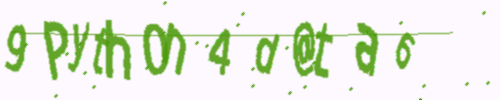

 
 

 
<!---->
 
 
#  Encode CAPTCHA

In this class, you'll learn how to encode CAPTCHA using python.                                                        

## Prerequisites:

1.  <b> Python Basics </b>
2.  <b> CAPTCHA Basics </b>
3.  <b> CAPTCHA module </b>

---

### 1. What is CAPTCHA?

| Acronym | Stands for |
|:---: |:--- |
| **`C`** | **Completely** |
| **`A`** | **Automated** |
| **`P`** | **Public** |
| **`T`** | **Turing test to tell** |
| **`C`** | **Computers and** |
| **`H`** | **Humans** |
| **`A`** | **Apart** |

Its primary motive is to determine whether the user is a real human or a spam robot. CAPTCHA is an example of one-way conversion and a type of challenge-response test used in computing to determine whether or not the user is human.

The most common form is Image CAPTCHA. You are shown an image and if you are a real person, then you need to enter its text in a separate field.

### Types of CAPTCHA

#### 1. Image CAPTCHA
The CAPTCHA presents characters in a way that is alienated and requires interpretation. Alienation can involve scaling, rotation, distorting characters. It can also involve overlapping characters with graphic elements such as colour, background noise, lines, arcs, or dots. This alienation provides protection against bots with insufficient text recognition algorithms but can also be difficult for humans to interpret.

  
 

  

#### 2. Audio CAPTCHA
Audio CAPTCHAs were developed as an alternative that grants accessibility to visually impaired users. These CAPTCHAs are often used in combination with text or image-based CAPTCHAs. Audio CAPTCHAs present an audio recording of a series of letters or numbers which a user then enters.

These CAPTCHAs rely on bots not being able to distinguish relevant characters from background noise. Like text-based CAPTCHAs, these tools can be difficult for humans to interpret as well as for bots.

---

## Install Necessary Modules:

Open your  Prompt  and type and run the following command (individually):

 -       pip install captcha  
 

Once Installed now we can import it inside our python code.

---

## Frequently asked questions ❔

### How can I thank you for writing and sharing this tutorial? 🌷

You can  and  Starring and Forking is free for you, but it tells me and other people that it was helpful and you like this tutorial.

Go [**`here`**](https://github.com/milaan9/01_Python_Introduction) if you aren't here already and click ➞ **`✰ Star`** and **`ⵖ Fork`** button in the top right corner. You will be asked to create a GitHub account if you don't already have one.

---

### How can I read this tutorial without an Internet connection? 

1. Go [**`here`**](https://github.com/milaan9/91_Python_Mini_Projects) and click the big green ➞ **`Code`** button in the top right of the page, then click ➞ [**`Download ZIP`**](https://github.com/milaan9/91_Python_Mini_Projects/archive/refs/heads/main.zip).

    

2. Extract the ZIP and open it. Unfortunately I don't have any more specific instructions because how exactly this is done depends on which operating system you run.
    
3. Launch ipython notebook from the folder which contains the notebooks. Open each one of them
  
    `Kernel > Restart & Clear Output`
    
This will clear all the outputs and now you can understand each statement and learn interactively.

If you have git and you know how to use it, you can also clone the repository instead of downloading a zip and extracting it. An advantage with doing it this way is that you don't need to download the whole tutorial again to get the latest version of it, all you need to do is to pull with git and run ipython notebook again.

---

## Authors ✍️

I'm Dr. Milaan Parmar and I have written this tutorial. If you think you can add/correct/edit and enhance this tutorial you are most welcome🙏

See [github's contributors page](https://github.com/milaan9/91_Python_Mini_Projects/graphs/contributors) for details.

If you have trouble with this tutorial please tell me about it by [Create an issue on GitHub](https://github.com/milaan9/91_Python_Mini_Projects/issues/new). and I'll make this tutorial better. This is probably the best choice if you had trouble following the tutorial, and something in it should be explained better. You will be asked to create a GitHub account if you don't already have one.

If you like this tutorial, please [give it a ⭐ star](https://github.com/milaan9/91_Python_Mini_Projects).

---

## Licence 📜

You may use this tutorial freely at your own risk. See [LICENSE](https://github.com/milaan9/91_Python_Mini_Projects/blob/main/LICENSE).

Copyright (c) 2020 Dr. Milaan Parmar

---

<h3> Connect with me
</h3> 

    
    
    
     

 
