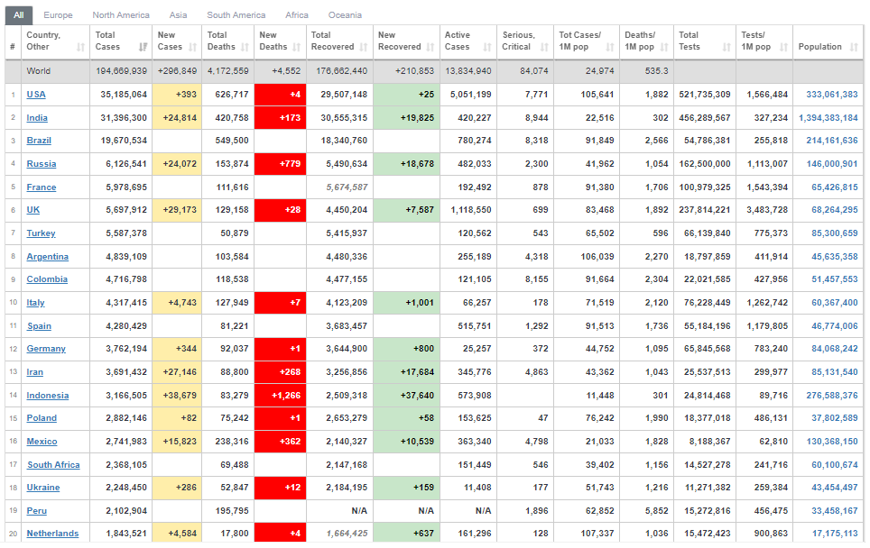

<p align="center"> 
<a href="https://github.com/milaan9"></a> 
<a href="https://hits.seeyoufarm.com"></a>
</p> 
<!---->
 
 
#  Web Scraping Covid-19 Data

In this class, you'll learn how to perform web scraping on Covid-19 data using python.                                                        


## Prerequisites:

1.  <b> Python Basics </b>
2.  <b> pandas Basics </b>
3.  <b> HTML Basics </b>
4.  <b> CSS module </b>
5.  <b> Beautiful soup/bs4 module </b>
6.  <b> requests module </b>
7.  <b> lxml module </b>

---

### 1. What is Web Scrapping??

**[Web scraping](https://en.wikipedia.org/wiki/Web_scraping)**, also known as web **data extraction**, is the process of retrieving or “scraping” data from a website. This information is collected and then exported into a format that is more useful for the user. Be it a spreadsheet or an API.

#### Two important points to be taken into consideration here:

1. Always be respectful and try to get permission to scrape, do not bombard a website with scraping requests, otherwise, your IP address may get blocked!
2. Be aware that websites change often, meaning your code could go from working to totally broken from one day to the next.

#### The Process: 
1. Request for a response from the webpage
2. Parse and extract with the help of Beautiful soup and lxml
3. Download and export the data with pandas into excel

#### Uses
It can serve several purposes, most popular ones are Investment Decision Making, Competitor Monitoring, News Monitoring, Market Trend Analysis, Appraising Property Value, Estimating Rental Yields, Politics and Campaigns and many more.

### 2. Covid-19 Data Source

We will use **[Worldometer](https://www.worldometers.info/coronavirus/#countries)** website to fetch the data becasue we are interested in the data contained in a table at Worldometer’s website, where it lists all the countries together with their current reported coronavirus cases, new cases for the day, total deaths, new deaths for the day, etc

<p align="center">  
 
</p>  

<p align="center">  
 
</p>  

### 3. HTML

```html
<!DOCTYPE html>
<html>
  <head>
  </head> 
  <body>
    <h1> Scrapping </h1>
    <p> Hello </p>
  </body>
</html>
```

* **`<!DOCTYPE html>`**: HTML documents must start with a type declaration.
* The HTML document is contained between **`<html>`** and **`</html>`** .
* The meta and script declaration of the HTML document is between **`<head>`** and **`</head>`** .
* The visible part of the HTML document is between **`<body>`** and **`</body>`** tags.
* Title headings are defined with the **`<h1>`** through **`<h6>`** tags.
* Paragraphs are defined with the **`<p>`** tag.
* Other useful tags include **`<a>`** for hyperlinks, **`<table>`** for tables, **`<tr>`** for table rows, and **`<td>`** for table columns.
---

## Install Necessary Modules:

Open your [](https://www.continuum.io/downloads) Prompt  and type and run the following command (individually):

 -       pip install requests
 -       pip install lxml
 -       pip install bs4  
 
### requests
* Use the requests library to grab the page.
* This may fail if you have a firewall blocking Python/Jupyter.
* Sometimes you need to run this twice if it fails the first time.


### Beautiful soup
**[BeautifulSoup](https://www.crummy.com/software/BeautifulSoup/bs4/doc/)** library already has lots of built-in tools and methods to grab information from a string of this nature (basically an HTML file). It is a Python library for pulling data out of HTML and XML files.

Using BeautifulSoup we can create a "soup" object that contains all the "ingredients" of the webpage.

Once Installed now we can import it inside our python code.

---

## Frequently asked questions ❔

### How can I thank you for writing and sharing this tutorial? 🌷

You can  Starring is free for you, but it tells me and other people that it was helpful and you like this tutorial.

Go [here](https://github.com/milaan9/01_Python_Introduction) if you aren't here already and click the "⭐ Star" button in the top right corner. You will be asked to create a GitHub account if you don't already have one.

### How can I read this tutorial without an Internet connection? 🤔

1. Go [here](https://github.com/milaan9/91_Python_Mini_Projects) if you aren't here already.
    
2. Click the big green "Clone or download" button in the top right of the page, then click "[Download ZIP](https://github.com/milaan9/91_Python_Mini_Projects/archive/refs/heads/main.zip)".

    

3. Extract the ZIP and open it. Unfortunately I don't have any more specific instructions because how exactly this is done depends on which operating system you run.
    
4. Launch ipython notebook from the folder which contains the notebooks. Open each one of them
  
    `Kernel > Restart & Clear Output`
    
This will clear all the outputs and now you can understand each statement and learn interactively.

If you have git and you know how to use it, you can also clone the repository instead of downloading a zip and extracting it. An advantage with doing it this way is that you don't need to download the whole tutorial again to get the latest version of it, all you need to do is to pull with git and run ipython notebook again.

---

## Authors ✍️

I'm Dr. Milaan Parmar and I have written this tutorial. If you think you can add/correct/edit and enhance this tutorial you are most welcome🙏

See [github's contributors page](https://github.com/milaan9/91_Python_Mini_Projects/graphs/contributors) for details.

If you have trouble with this tutorial please tell me about it by [Create an issue on GitHub](https://github.com/milaan9/91_Python_Mini_Projects/issues/new). and I'll make this tutorial better. This is probably the best choice if you had trouble following the tutorial, and something in it should be explained better. You will be asked to create a GitHub account if you don't already have one.

If you like this tutorial, please [give it a ⭐ star](https://github.com/milaan9/91_Python_Mini_Projects).

---

## Licence 📜

You may use this tutorial freely at your own risk. See [LICENSE](https://github.com/milaan9/91_Python_Mini_Projects/blob/main/LICENSE).

Copyright (c) 2020 Dr. Milaan Parmar

---

<div align="center">
<h3> Connect with me<a href="https://gifyu.com/image/Zy2f"></a>
</h3> 
<p align="center">
    <a href="https://www.linkedin.com/in/milaanparmar" target="_blank"></a>
    <a href="https://www.instagram.com/milaanparmar9" target="_blank"></a>
    <a href="https://www.facebook.com/milaanparmar" target="_blank"></a>
    <a href="mailto:milaanparmar9@gmail.com" target="_blank"></a> 
</p> 
